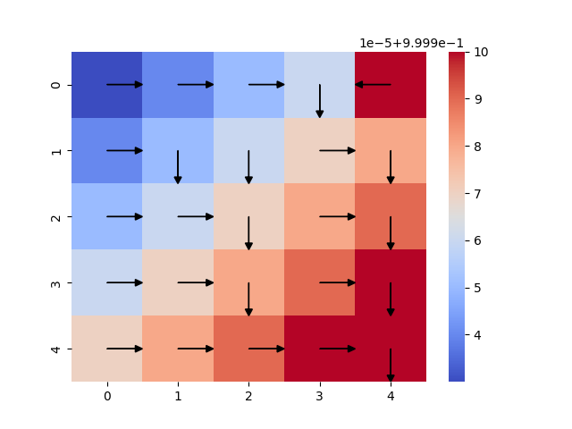
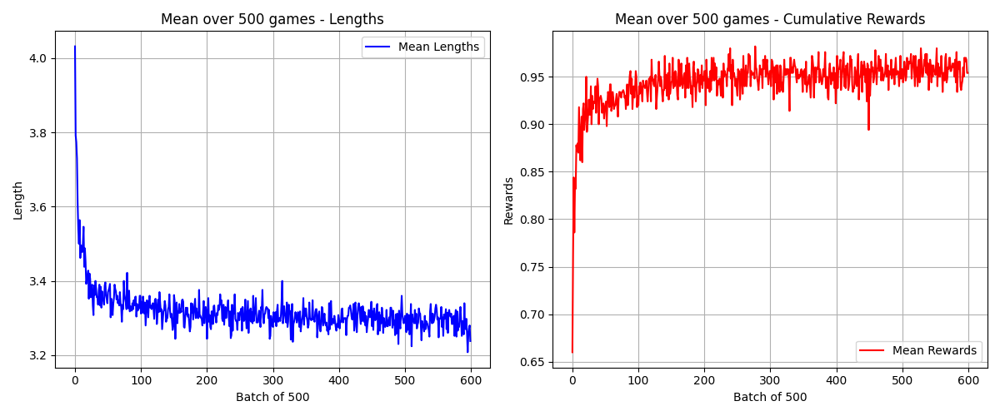
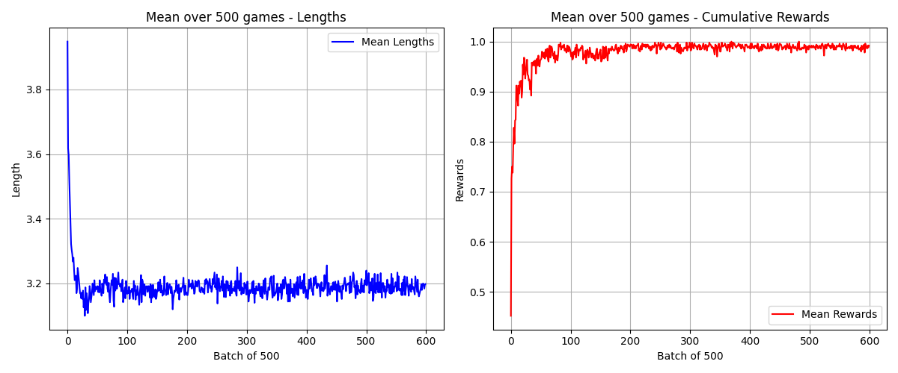
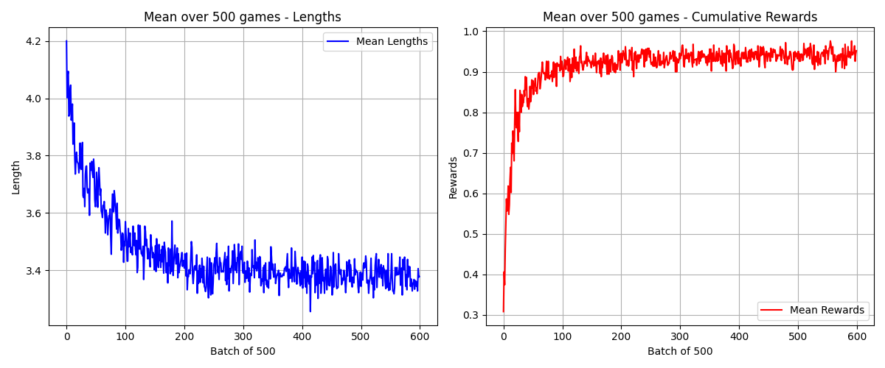
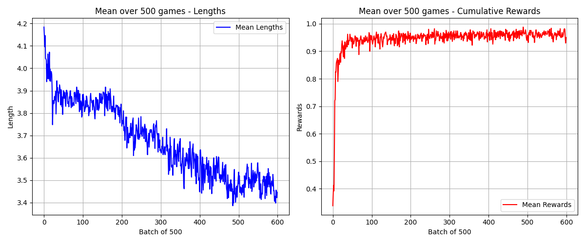

# Apprentissage par renforcement

## Introduction

L'objectif de ce projet de groupe est d'implémenter "from scratch" différents algorithmes d'apprentissage par renforcement sur divers environnements de difficulté croissante, tels que *Line World*, *Grid World* et *Tic-Tac-Toe*.

Ce projet permet d'améliorer la compréhension de ces algorithmes et de comparer leurs performances. On distingue trois grandes catégories d'algorithmes :

- **Programmation dynamique** : Utilisable lorsque le modèle de l'environnement est connu. Autrement dit, si une action *a* est effectuée dans un état *s*, la distribution des probabilités menant à un nouvel état *s'* et la récompense associée *r* sont connues. Il est ainsi possible de déterminer la meilleure stratégie sans simuler de parties, en utilisant le modèle (aussi appelé matrice de transition).

- **Méthode de Monte Carlo** : Lorsque le modèle de l'environnement est inconnu (ce qui est généralement le cas dans des problèmes réels), un grand nombre de parties est joué afin d'estimer la meilleure stratégie. Un compromis est alors nécessaire entre l'exploration et l'exploitation :

  - *Exploitation* : choisir une action qui maximise la récompense connue.
  - *Exploration* : tester de nouvelles actions pouvant potentiellement offrir de meilleures récompenses.

- **Temporal Difference (TD)** : Lorsqu'il est impossible de définir une fin de partie, il est alors nécessaire d'ajuster la stratégie à chaque action, plutôt que d'attendre la fin d'une partie pour mettre à jour les valeurs d'états.

## Structure du projet

La structure du projet a été définie par notre enseignant :

- `drl_sample_project_python/drl_lib/to_do` : contient les différents algorithmes.
- `drl_sample_project_python/drl_lib/custom_monte_carlo_env` : contient les environnements pour les méthodes de Monte Carlo et Temporal Difference.
- `drl_sample_project_python/drl_lib/custom_dynamic_programming_env` : contient les environnements pour les algorithmes de programmation dynamique.
- `drl_sample_project_python/drl_lib/tictactoe_interface` : interface pour jouer à *Tic-Tac-Toe* contre notre modèle (code inspiré de [ce lien](https://www.geeksforgeeks.org/tic-tac-toe-gui-in-python-using-pygame/)).
- `drl_sample_project_python/main.py` : permet d'exécuter les différents algorithmes.

> **Note** : Il faut commenter/décommenter les parties du code que l'on souhaite exécuter.

## Programmation dynamique

Résultat obtenu avec l'algorithme *Value Iteration* sur le jeu *Grid World* :

Le joueur se déplace sur une grille `5x5`, avec une case perdante (haut droite) et une case gagnante (bas droite).

Les flèches noires indiquent la direction optimale à suivre pour chaque case. Les flèches sur les cases gagnante et perdante sont aléatoires et n'ont pas d'impact sur le joueur.

L'algorithme suit deux étapes principales :

1. **Calcul de la value function** : Pour chaque état *s*, on moyenne les valeurs des états suivants *s'* et les récompenses *r* associées. Ce processus est répété jusqu'à stabilisation des valeurs.
2. **Détermination de la policy optimale** : On choisit l'action qui maximise la *value function* pour chaque état.

## Méthode de Monte Carlo

Résultat obtenu sur *Tic-Tac-Toe* contre un adversaire jouant aléatoirement (le modèle joue en premier).

### Algorithme *On-Policy Monte Carlo* :

### Algorithme *Off-Policy Monte Carlo* :

Les graphiques représentent :

- **Gauche** : l'évolution du nombre de coups par partie.
- **Droite** : la récompense cumulée moyenne sur les 500 dernières parties.

Dans les deux cas :
- La récompense tend vers `1` (100% de victoires).
- La durée moyenne des parties diminue, tendant vers `3` (nombre minimal de coups pour gagner).

### Différences entre *On-Policy* et *Off-Policy* :

- **On-Policy** : la stratégie évolue à chaque partie et joue les parties suivantes. Un facteur d'exploration (`ε = 0.1`) est utilisé pour éviter les stratégies sous-optimales. Une action aléatoire est effectuée 10% du temps.
- **Off-Policy** : les parties sont jouées avec une stratégie aléatoire, tandis que la politique optimale s'améliore en observant les résultats. Cette approche est plus stable car elle n'a pas besoin d'un facteur d'exploration.

## Temporal Difference

Résultat obtenu sur *Tic-Tac-Toe* contre un adversaire aléatoire.

### Algorithme *SARSA (On-Policy)* :

### Algorithme *Q-Learning (Off-Policy)* :

Comme pour Monte Carlo, la récompense tend vers `1` et la durée des parties diminue. Toutefois, les résultats sont légèrement inférieurs à ceux de Monte Carlo, en raison de :

- **L'ajout d'un hyperparamètre** influençant le taux de modification des valeurs d'états.
- **L'apprentissage incrémental** à chaque action, ce qui peut rendre l'ajustement sous-optimal avant la fin d'une partie. Contrairement à Monte Carlo, qui met à jour la stratégie à la fin d'un épisode.
